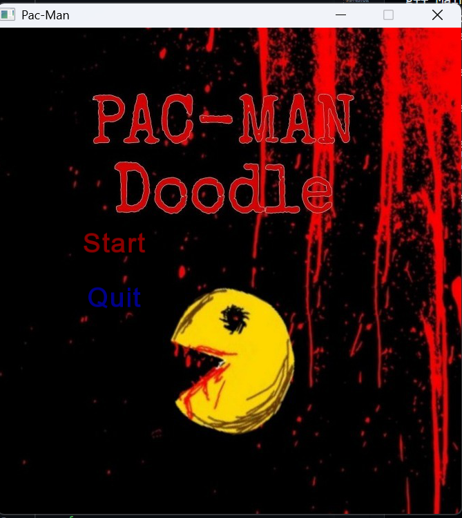
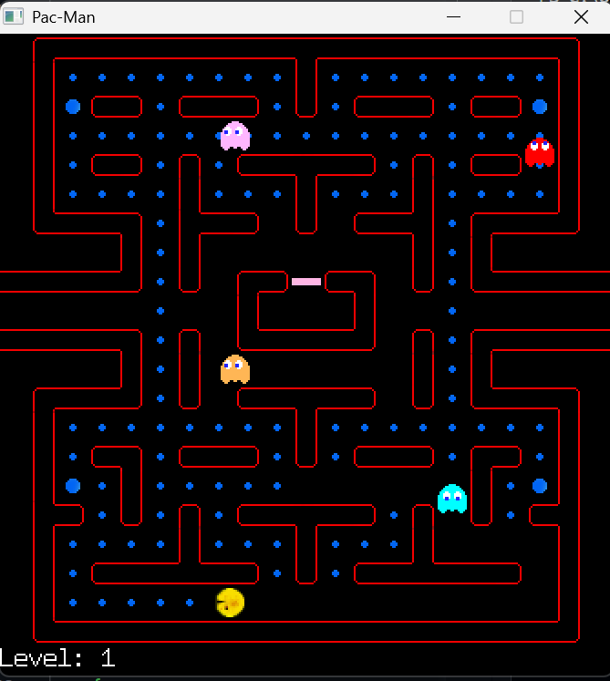
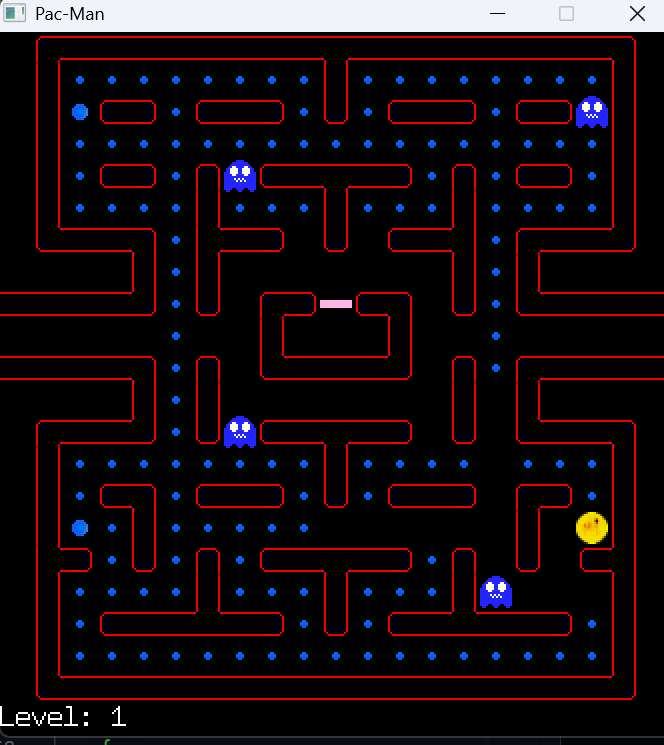
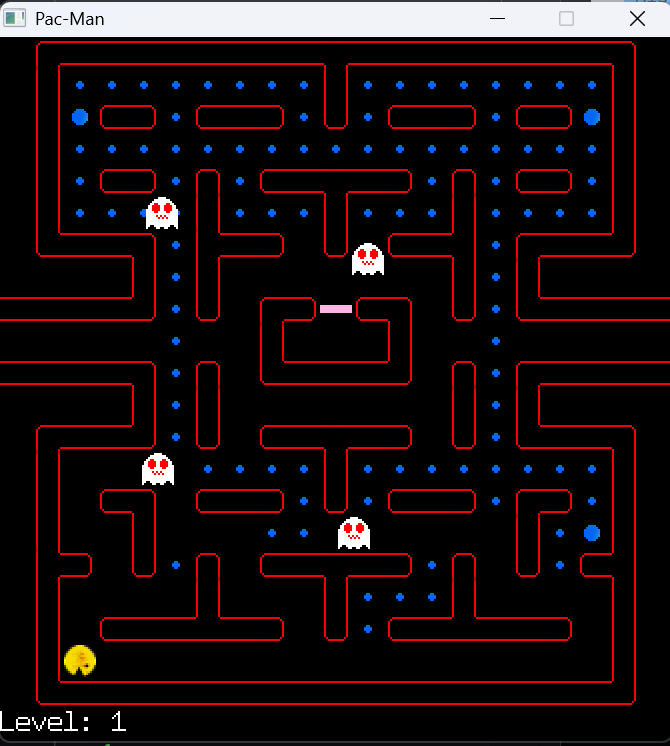
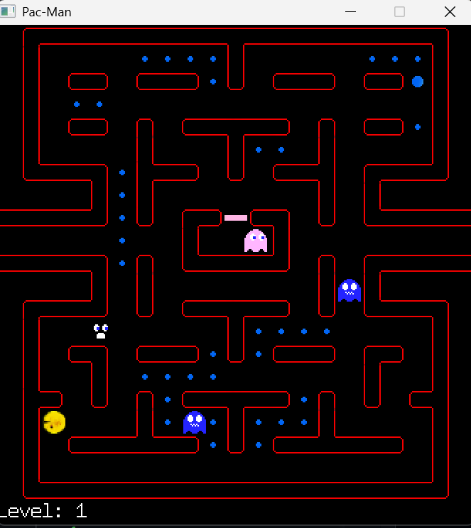
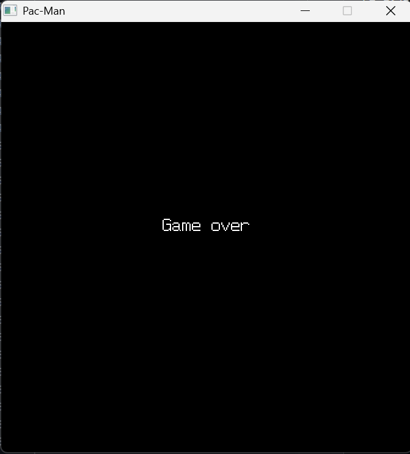

# 🎮 Pac-Man: An Object-Oriented Game

A modern recreation of the classic **Pac-Man** game built using **C++** and **SFML**, demonstrating key object-oriented programming concepts like **encapsulation**, **inheritance**, and **polymorphism**.

## 👥 Group Members

- Syed Muhammad Muzammil – 24k-2000  
- Syed Muhammad Ahsan – 24k-2041  
- Anas Haider – 24k-2002  

## 📅 Submission Date

11 May 2025

## 🚀 Features

- Object-Oriented Architecture (C++ Classes)
- SFML-based graphics and animation
- Ghost AI (basic pathfinding with different modes)
- Pellet collection and scoring system
- Power-ups with temporary ghost vulnerability
- Level progression and game-over scenarios
- Responsive controls and animated characters

## 🧠 OOP Concepts Used

- **Encapsulation**: Data and behavior bundled within classes  
- **Inheritance**: Shared functionality among game entities  
- **Polymorphism**: Dynamic behavior based on entity state

## 📁 Project Structure

- `PacMan.h / .cpp`: Pac-Man class and movement logic  
- `Ghost.h / .cpp`: Ghost AI and behaviors  
- `Maze.h / .cpp`: Maze layout and wall detection  
- `GameEngine.cpp`: Core game loop and logic  
- `main.cpp`: Entry point  
- `resources/`: Sprite sheets, sounds, and maze assets  

## 🕹️ How to Play

1. Open terminal in the project directory  
2. Compile the project using `make`  
3. Run the game with `./sfml-app`  
4. Use **arrow keys** to move Pac-Man and collect pellets  
5. Avoid ghosts (or eat them if you’ve collected a power-up!)

## 🛠 Tools & Technologies

- **Language**: C++  
- **Library**: SFML (Simple and Fast Multimedia Library)  
- **Development Style**: Iterative & Agile

## ✅ Testing

- Manual testing of all gameplay features  
- Validated collisions, AI behavior, and scoring logic  
- Ensured performance stability and no memory leaks

- ## 📌 Future Improvements

- Advanced ghost AI with adaptive difficulty  
- Custom maze editor  
- Additional levels and multiplayer mode

## 🖼️ Screenshots

### Game Start – Intro  

### Gameplay – Pac-Man Collecting Pellets  

### Power-Up – Ghosts Turn Blue!  

### Ghost Blinkers – Intense Action  

### Eating Ghost – Intense Action  

### Game Over Screen  

## 📌 Future Improvements

- Advanced ghost AI with adaptive difficulty  
- Custom maze editor  
- Additional levels and multiplayer mode

## 📃 License

This project is for academic purposes only and not for commercial use.

---

